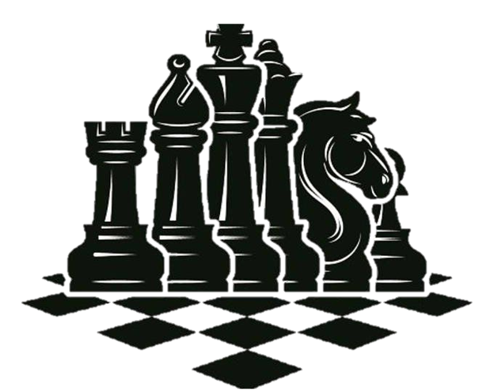

# IFT6756
<!--
*** Thanks for checking out the Best-README-Template. If you have a suggestion
*** that would make this better, please fork the repo and create a pull request
*** or simply open an issue with the tag "enhancement".
*** Thanks again! Now go create something AMAZING! :D
-->


<!-- PROJECT SHIELDS -->
<!--
*** I'm using markdown "reference style" links for readability.
*** Reference links are enclosed in brackets [ ] instead of parentheses ( ).
*** See the bottom of this document for the declaration of the reference variables
*** for contributors-url, forks-url, etc. This is an optional, concise syntax you may use.
*** https://www.markdownguide.org/basic-syntax/#reference-style-links
-->


<!-- PROJECT LOGO -->
<br />
<p align="center">
  <a href="https://github.com/MAliElakhrass/DeepYed">
    
  </a>

  <h3 align="center">Final project 6756</h3>
</p>


<!-- TABLE OF CONTENTS -->
<details open="open">
  <summary>Table of Contents</summary>
  <ol>
    <li>
      <a href="#about-the-project">About The Project</a>
      <ul>
        <li><a href="#built-with">Built With</a></li>
      </ul>
    </li>
    <li>
      <a href="#getting-started">Getting Started</a>
      <ul>
        <li><a href="#prerequisites">Prerequisites</a></li>
        <li><a href="#installation">Installation</a></li>
      </ul>
    </li>
    <li><a href="#heuristic-approach">Heuristic Approach</a></li>
    <li><a href="#neural-network">Neural Network</a></li>
    <li><a href="#reinforcement-learning">Heuristic Approach</a></li>
    <li><a href="#license">License</a></li>
    <li><a href="#acknowledgements">Acknowledgements</a></li>
  </ol>
</details>


<!-- ABOUT THE PROJECT -->
## About The Project


Our goal was to evaluate and quantify the performance of various intelligent agent approaches applied to chess. We have explored three approaches to machine learning:
  1. Tree traversal;
  2. neural network;
  3. Reinforcement learning approaches.

With the resources available, our best agent was our Negamax research agent, with an ELO of around 1300. The neural network approach produced an excellent agent for determining the best move mid-game, but not for a game. complete. Finally, our results for the reinforcement learning approach are comparable to those obtained initially by the opensource project Leela Zero, i.e. an ELO of around 500

### Built With

This section lists any the major frameworks that we built our project using. 
* [Python](https://www.python.org/)
* [Tensorflow](https://www.tensorflow.org/)
* [Keras](https://keras.io/)
* [CUDA](https://developer.nvidia.com/cuda-toolkit)


<!-- GETTING STARTED -->
## Getting Started

To get a local copy up and running follow these simple example steps.

### Prerequisites

You should run one of the two commands in your terminal in order to install all the requirements for the project.
* pip
  ```sh
  pip install -r requirements.txt
  ```

* conda
  ```sh
  conda install --file requirements. txt
  ```

### Installation


1. Clone the repo
   ```sh
   git clone https://github.com/MAliElakhrass/DeepYed.git
   ```
2. Download the Stockfish engine from [https://stockfishchess.org/download/](https://stockfishchess.org/download/windows/) and place it under the `/engines` folder
3. Download the opening books from [https://rebel13.nl/download/books.html](https://rebel13.nl/download/books.html) and uncompress the content of the folder books under the `/books` folder

## Open a pgn file
You can read a pgn file in any text editor. However, if you want to watch the game, you have to download a Graphical User Interface (GUI) for chess. We recommend Scid or Arena.

## Negamax approach
For this approach there is nothing to train. In order to play this agent against Stockfish, run the following command in the command line
  ```sh
   python3 Heuristic/play.py 1 3 10
  ```
The first argument represents the stockfish level, the second represents the depth of our algorithm and the third argument represents the number of games to play.

At the end of each game, a pgn file will be created and you'll be able to watch the game.

## Neural Network

* If you don't want to retrain the model:
  You can play against Stockfish by running experiment.py
  ```sh
   python3 NeuralNetKeras/experiment.py 1 3 10
  ```
  Again, the first argument represents the stockfish level, the second represents the depth of our algorithm and the third argument represents the number of games to play.

* If you want to retrain the model:
  1. Download the data from [CCRL](http://ccrl.chessdom.com/ccrl/4040/) and uncompress the 7z file into the `/data` folder
  
  2. The first step is to generate the data
      ```sh
      python3 NeuralNetKeras/DataGenerator.py
      ```
      Once this step is over, you'll have two new files in your `/data` folder: `black.npy` and `white.npy`
  
  3.  The second step is to train the autoencoder. (This step can be skipped if you want. We already save our encoder model)
      ```sh
      python3 NeuralNetKeras/AutoEncoder.py
      ```
      Once this is over, the encoder will be saved in your `/weights` folder under the name `encoder.h5` 
  
  4. Finally, the last step is to train the siamese.
      ```sh
        python3 NeuralNetKeras/SiameseNetwork.py
      ```
      Once this step is over, the siamese model will be saved in your `/model` folder under the name `DeepYed.h5`

## Reinforcement learning
  For this part, we based our code from the AlphaZero General Framework available from [AlphaZero General Framework](https://github.com/suragnair/alpha-zero-general)
  * If you don't want to retrain the model:
    You can play against Stockfish by running experiment.py
    ```sh
    python3 GeneralFramework/pit.py 1 10
    ```
    The first argument represents the stockfish level, the second represents the number of games to play.
  * If you want to retrain the model:
      ```sh
      python3 GeneralFramework/main.py
      ```

<!-- LICENSE -->
## License

Distributed under the MIT License. See `LICENSE` for more information.


<!-- ACKNOWLEDGEMENTS -->
## Acknowledgements
* [AlphaZero General Framework](https://github.com/suragnair/alpha-zero-general)
* [DeepChess](https://arxiv.org/abs/1711.09667)
